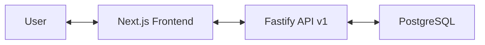
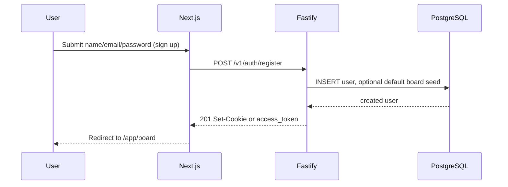
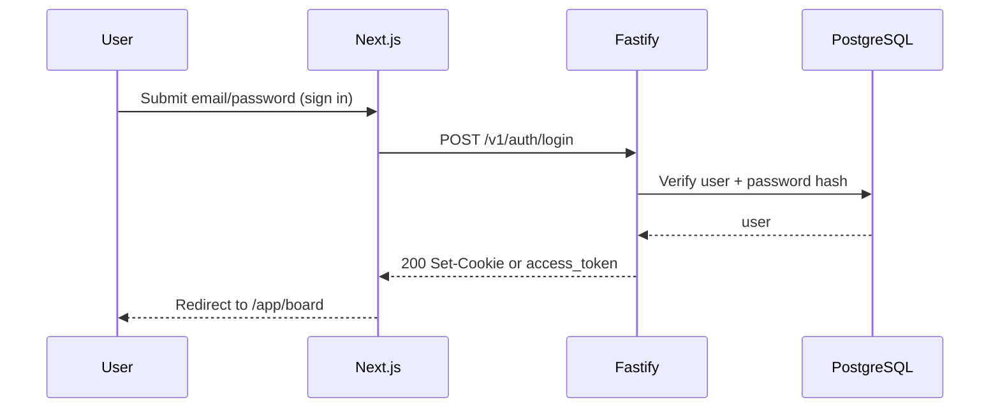
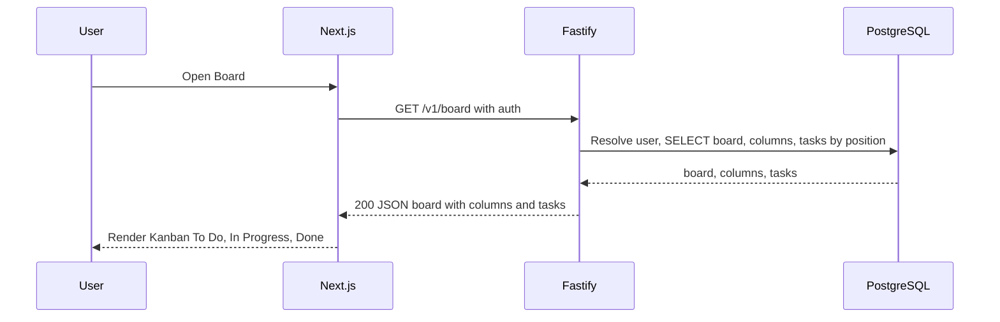
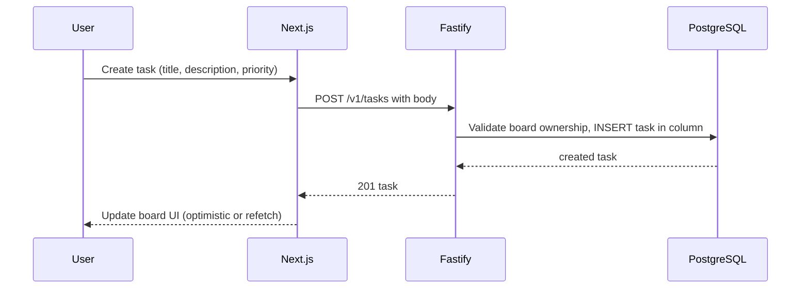
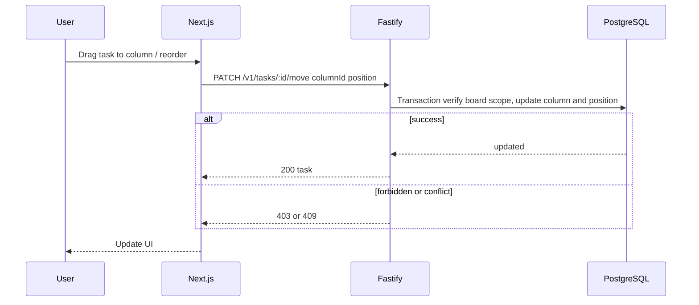

# TaskFlow — Architecture

## Implementation status (current vs planned)

| Area              | Current                                                        | Planned (this doc)                                  |
| ----------------- | -------------------------------------------------------------- | --------------------------------------------------- |
| **API base path** | `/api/tasks` (scaffold), `/health`                             | `/v1` (auth, board, tasks)                          |
| **Auth**          | Not implemented                                                | JWT register/login/logout, protected routes         |
| **Data model**    | `User`, `Task` (status, priority, position) in PostgreSQL (pg) | User, Board, Column, Task; board ownership          |
| **API endpoints** | GET /api/tasks → 501                                           | Full REST: auth, GET/PATCH board, CRUD + move tasks |
| **OpenAPI**       | `contracts/openapi.json` exists, paths empty                   | Contract exported from API, client generated        |
| **CI**            | GitHub Actions: lint, test, build                              | Same                                                |

The sections below describe the **target** architecture. Implement toward them to remove drift.

---

## High-Level Overview

The system is a decoupled full-stack application:

- **Frontend** (Next.js, App Router + shadcn/ui) serves UI, public landing, auth pages, and the authenticated Kanban board.
- **Backend** (Fastify) exposes versioned REST API under `/v1` with OpenAPI/Swagger.
- **DB** (PostgreSQL) stores users, boards, columns, and tasks via pg (schema in `apps/api/schema.sql`).

## Goals

- Nx integrated monorepo.
- Auth: JWT in httpOnly cookie (or bearer); register/login/logout; protected routes by user.
- OpenAPI contract in `contracts/openapi.json`; generated client in `libs/api-client` for the web app.
- Tests: Web — unit (Vitest) + e2e (Playwright); API — unit (Vitest) + integration (Testcontainers + pg) + e2e (Supertest).
- Docker: single `docker-compose.yml`. CI: GitHub Actions (lint + build + tests).

## System Context Diagram



## Auth Flow (Registration With Auto-Login)



## Auth Flow (Login)



## Request Flow (Board Read)



## Request Flow (Create Task)



## Request Flow (Move Task)



## Request Flow (Update / Delete Task)

- **PATCH /v1/tasks/:id** — update title, description, priority; ownership and board scope enforced.
- **DELETE /v1/tasks/:id** — delete task; 403 if not owner / wrong board.

## Monorepo Layout

```
.
├─ apps/
│  ├─ web/                # Next.js (shadcn/ui, landing, sign-up/sign-in, /app/board)
│  └─ api/                # Fastify API (/v1, OpenAPI)
├─ libs/
│  ├─ shared/             # Shared types + Zod schemas
│  └─ api-client/         # Generated OpenAPI client for web
├─ contracts/
│  └─ openapi.json        # Exported OpenAPI from API
├─ docker/
│  ├─ api.Dockerfile
│  └─ web.Dockerfile
├─ tools/
│  └─ scripts/            # Helper scripts (OpenAPI export, etc.)
└─ memory_bank/           # Agent workflow docs (optional)
```

## Runtime Architecture

- **web** calls **api** over HTTP; `NEXT_PUBLIC_API_URL` points to API; credentials included (cookie or Authorization header).
- **api** uses **pg** (node-postgres) to talk to **PostgreSQL**.
- Auth: JWT in httpOnly cookie (recommended) or bearer token; middleware/plugin verifies auth and attaches user to request for protected routes.
- Data isolation: all board/task operations scoped by authenticated user (and optionally board ownership).

## Services & Ports (docker-compose)

- web: http://localhost:3000
- api: http://localhost:3001
- API docs: http://localhost:3001/docs
- postgres: localhost:5432

## API Conventions

- Base path: **/v1** (e.g. `/v1/auth/register`, `/v1/board`, `/v1/tasks`).
- Auth: POST `/v1/auth/register`, POST `/v1/auth/login`, POST `/v1/auth/logout` (if cookie).
- Board: GET `/v1/board` (default board with columns and tasks, sorted by position); optional PATCH `/v1/board` (rename).
- Tasks: POST `/v1/tasks`, PATCH `/v1/tasks/:id`, DELETE `/v1/tasks/:id`, PATCH `/v1/tasks/:id/move` (column + position).
- Responses: JSON. Validation: Fastify schemas (JSON Schema / TypeBox) or Zod.
- Error contract: 400 validation, 401 unauth, 403 forbidden, 404 not found, 409 conflict; body e.g. `{ code, message, details? }`.

## OpenAPI Contract & Client Generation

1. API exports OpenAPI to `contracts/openapi.json`.
2. Client is generated into `libs/api-client` (types + fetch wrapper).

Nx targets:

- `nx run api:openapi` → updates `contracts/openapi.json`
- `nx run api-client:generate` → regenerates client from contract

## Testing Strategy

### API

- Unit: pure functions / services.
- Integration: Postgres via Testcontainers, pg client, then DB/auth logic.
- E2E: Fastify in-memory, Supertest against `/v1` endpoints.

### Web

- Unit: Vitest + Testing Library (components, pages).
- E2E: Playwright (e.g. sign up → create task → move → delete).

## Quality Gates

- ESLint + import order + absolute imports.
- Husky + lint-staged pre-commit.
- CI: lint, test, build.

## Core Architectural Notes

- Authentication is JWT-based; cookie (httpOnly, Secure, SameSite) recommended; optional bearer for API clients.
- POST `/v1/auth/register` can perform auto-login by setting session cookie or returning access token.
- Data isolation: every board and task operation checks ownership / user scope.
- Board model: default board per user, 3 columns (To Do, In Progress, Done); tasks have position for ordering; move supports reorder within column and across columns with a deterministic strategy (e.g. numeric position with gaps or reindex in transaction).
- API-first: versioned contract in `contracts/openapi.json`; frontend uses generated client from `libs/api-client`.
